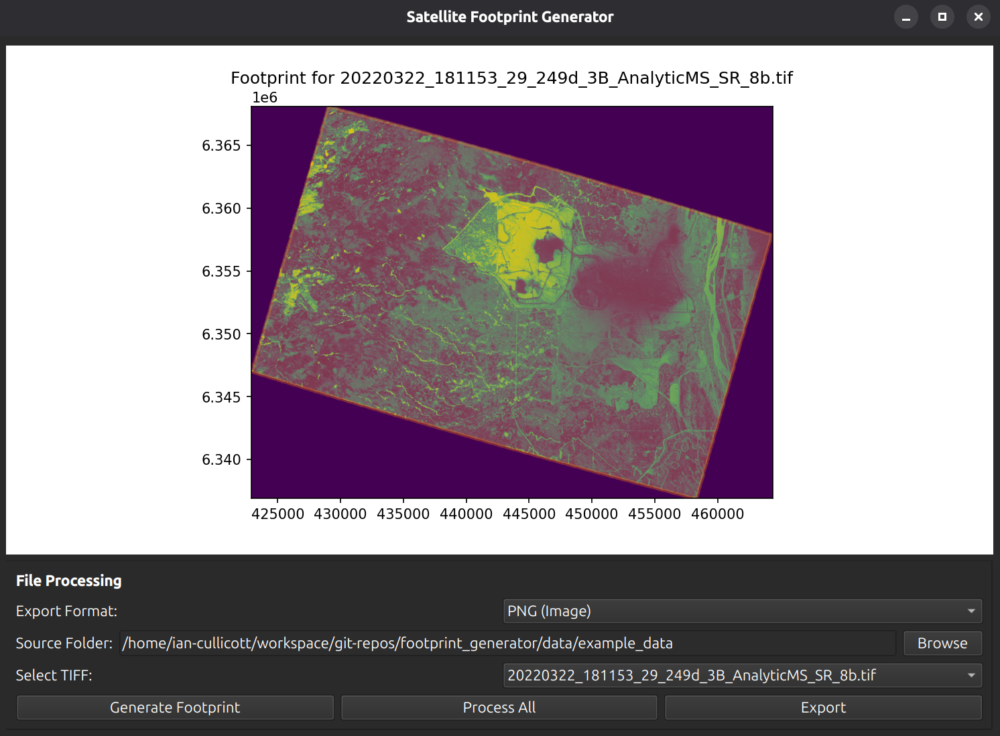

# GeoJSON Footprint Generator

Developed by Helena Beinhacker, David Bunich, and Ian Cullicott. 

The GeoJSON Footprint Generator is a specialized GIS utility designed to automate the extraction of precise geographic boundaries from raster data. By filtering out "no-data" artifacts and calculating the geometry of valid pixels, it transforms raw TIFF imagery into clean, usable GeoJSON footprints

## Features

* **TIFF Analysis**: Automatically calculates the geospatial boundary (footprint) of `.tif` and `.tiff` files.
* **Visual Preview**: Integrated plotting to view the satellite data and its calculated footprint before exporting.
* **Batch Processing**: "Process All" functionality to handle entire directories of imagery at once.
* **Multi-Format Export**: Support for common geospatial formats including **GeoJSON** and more.
* **User-Centric UI**: Built with PySide6, providing a modern, cross-platform desktop experience for GIS analysts..

## Getting Started

### Prerequisites

You will need `uv` installed on your system. If you don't have it yet, install [uv](https://github.com/astral-sh/uv):

1. Clone the repository
~~~bash
git clone https://github.com/Skipper2197/footprint_generator.git
cd footprint_generator
~~~
2. Sync dependencies and run
~~~bash
uv sync
uv run main.py
~~~

## Why this project?
The goal is to provide a user-friendly interface that simplifies complex GIS workflows, making it easier for users to visualize and process geographic data without manual intervention

## CRS Options
You can select select to export your file into different coordinate reference systems, such as:
  * **WGS84** globaly centered standard coordinate system for cartography, geospatial data, and GPS
  * **Web Mercator** commonly used for web mapping
